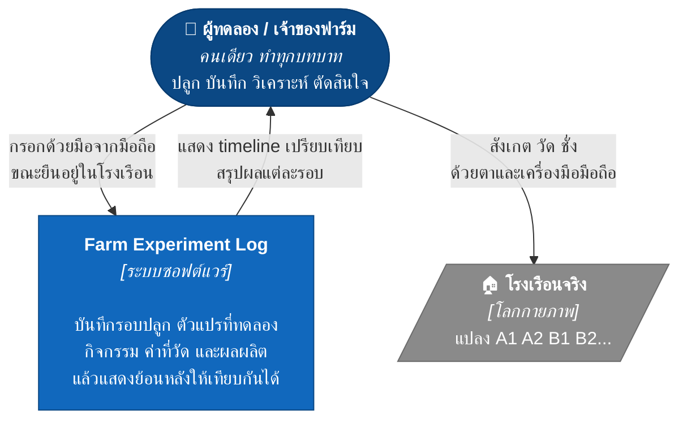
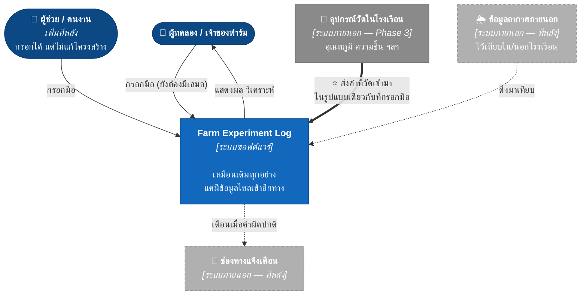

# 01 — System Context (C4 Level 1)

> สถานะ: 🟡 ร่าง
> ตอบคำถาม: **ระบบนี้คืออะไร ใครใช้ และต่อกับอะไรข้างนอกบ้าง**
> ระดับนี้ *ไม่พูดถึง* เทคโนโลยี ฐานข้อมูล หรือภาษาที่ใช้เขียน

---

## 1. ระบบนี้คืออะไร (นิยาม 1 ประโยค)

> **Farm Experiment Log** — ระบบบันทึกสิ่งที่ทำและสิ่งที่เกิดขึ้นในโรงเรือนทดลอง เพื่อให้ย้อนกลับไปตอบได้ว่า *"ทำไมรอบนั้นถึงได้ผลดีกว่า"*

**ไม่ใช่:** ระบบควบคุมโรงเรือน, ระบบ dashboard เซนเซอร์, ระบบบัญชีฟาร์ม, ระบบขายของ

การนิยามว่า "ไม่ใช่อะไร" สำคัญพอๆ กับนิยามว่าคืออะไร เพราะทั้ง 4 อย่างข้างบนเป็นสิ่งที่จะไหลเข้ามาเองถ้าไม่กันไว้

---

## 2. ภาพรวมวันนี้ (Phase 2 — ยังไม่มี sensor)

**สังเกตว่าตอนนี้มี actor เดียว และไม่มีระบบภายนอกเลย — อันนี้จงใจ**

ระบบที่ไม่ต้องคุยกับใครเลยคือระบบที่พังยากที่สุด และเป็นจุดเริ่มที่ถูกต้องเมื่อยังไม่รู้ว่าโรงเรือนจะหน้าตายังไง

---

## 3. ภาพในอนาคต (Phase 3+ — เมื่อมี sensor แล้ว)

### ⭐ ประเด็นสำคัญที่สุดของทั้งเอกสารนี้

ระหว่างภาพ "วันนี้" กับ "อนาคต" กล่องกลางไม่เปลี่ยนเลย — **มีแค่ลูกศรเข้ามาเพิ่ม**

ที่เป็นแบบนี้ได้เพราะออกแบบให้ค่าที่วัดทุกค่ามี field ระบุ "แหล่งที่มา" ตั้งแต่วันแรก:

| ค่าที่วัด | เวลา | แปลง | ค่า | **แหล่งที่มา** |
|---|---|---|---|---|
| อุณหภูมิ | 8 ส.ค. 14:30 | A1 | 36.5 | `manual` ← วันนี้ |
| อุณหภูมิ | 8 ส.ค. 14:30 | A1 | 36.5 | `sensor:th-01` ← Phase 3 |

ข้อมูลที่กรอกมือไว้ 1 ปี **ยังใช้เทียบกับข้อมูลจาก sensor ได้ทันที** ไม่ต้อง migrate ไม่ต้องแยกตาราง

ถ้าเริ่มจาก dashboard อ่านค่า sensor แทน จะได้ตรงข้าม — ต้องรื้อทั้งหมดตอนรู้ว่าอยากบันทึกเรื่องที่ sensor วัดไม่ได้ (เช่น "วันนี้เห็นเพลี้ยที่ใบล่างของ B2")

---

## 4. ผู้ใช้และบทบาท

| ผู้ใช้ | เมื่อไร | ทำอะไรได้ | ข้อจำกัดที่กำหนดการออกแบบ |
|---|---|---|---|
| **เจ้าของฟาร์ม** (คุณ) | ตั้งแต่วันแรก | ทุกอย่าง | ยืนในโรงเรือน มือเปียก แดดจ้า ถือมือถือมือเดียว |
| **ผู้ช่วย/คนงาน** | Phase 4+ | กรอกข้อมูล ดูงานที่ต้องทำ | อาจไม่คุ้นเทคโนโลยี → ต้องกรอกได้โดยไม่ต้องสอน |
| **ผู้รับซื้อ** | Phase 5 | (ยังไม่เข้าระบบ) | อาจต้องการข้อมูลย้อนกลับของผลผลิต |

### ข้อจำกัดของผู้ใช้หลักที่กำหนดทุกอย่างต่อจากนี้

**การกรอกข้อมูลเกิดในโรงเรือน ไม่ใช่หน้าคอม** — ถ้ากรอกนานเกิน 15 วินาที คนจะเลิกกรอกภายใน 2 สัปดาห์ แล้วโปรเจกต์จบ (นี่คือเหตุผลที่ Phase 2 gate ใน [00-concept.md](00-concept.md) เขียนไว้ว่าต้อง "ทำต่อเนื่องได้โดยไม่หมดไฟ")

ข้อนี้สำคัญกว่าฟีเจอร์ทุกอย่างรวมกัน และเป็นเหตุผลที่:
- ต้องใช้ได้ตอนไม่มีเน็ต (สัญญาณในโรงเรือนกลางที่ดินไม่แน่นอน)
- ต้องไม่มี login
- ต้องมีปุ่มลัดสำหรับสิ่งที่ทำซ้ำทุกวัน
- หน้าจอต้องอ่านออกกลางแดด

---

## 5. ขอบเขต — อะไรอยู่ในระบบ อะไรไม่อยู่

| ✅ อยู่ในระบบ | ❌ ไม่อยู่ (อย่างน้อยตอนนี้) |
|---|---|
| โรงเรือนและแปลง (ผู้ใช้สร้างเอง) | การควบคุมอุปกรณ์ (เปิด-ปิดปั๊ม/พัดลม) |
| รอบปลูก + ตัวแปรที่ทดลอง | ระบบบัญชี / ต้นทุน-กำไรเต็มรูปแบบ |
| กิจกรรมที่ทำ (รดน้ำ ให้ปุ๋ย ตัดแต่ง) | ระบบขาย / ออเดอร์ลูกค้า |
| ค่าที่วัด (มือหรือ sensor) | สต๊อกวัสดุ / คลังสินค้า |
| ผลผลิตที่เก็บได้ | การจัดตารางงานคนงาน |
| รูปถ่ายประกอบ | โมเดลทำนายผลผลิตด้วย AI |
| การเทียบผลระหว่างแปลง/รอบ | |

**เหตุผลที่ตัดออกทั้งหมดนี้:** แต่ละอย่างเป็นระบบของตัวเองที่ใหญ่พอๆ กับตัวหลัก และไม่มีอันไหนช่วยตอบคำถาม *"ทำไมรอบนั้นได้ผลดีกว่า"* ซึ่งเป็นเหตุผลเดียวที่ระบบนี้มีอยู่

ต้นทุน/กำไรจะกลับมาใน Phase 4–5 แต่ตอนนั้นมันจะเป็น *มุมมองที่คำนวณจากข้อมูลที่มีอยู่แล้ว* ไม่ใช่ระบบใหม่ — ถ้าออกแบบ Harvest ให้เก็บน้ำหนักและเกรดไว้ตั้งแต่แรก

---

## ถัดไป

→ [02-container.md](02-container.md) — แยกระบบเป็นส่วนๆ และตอบว่าเก็บข้อมูลที่ไหน
