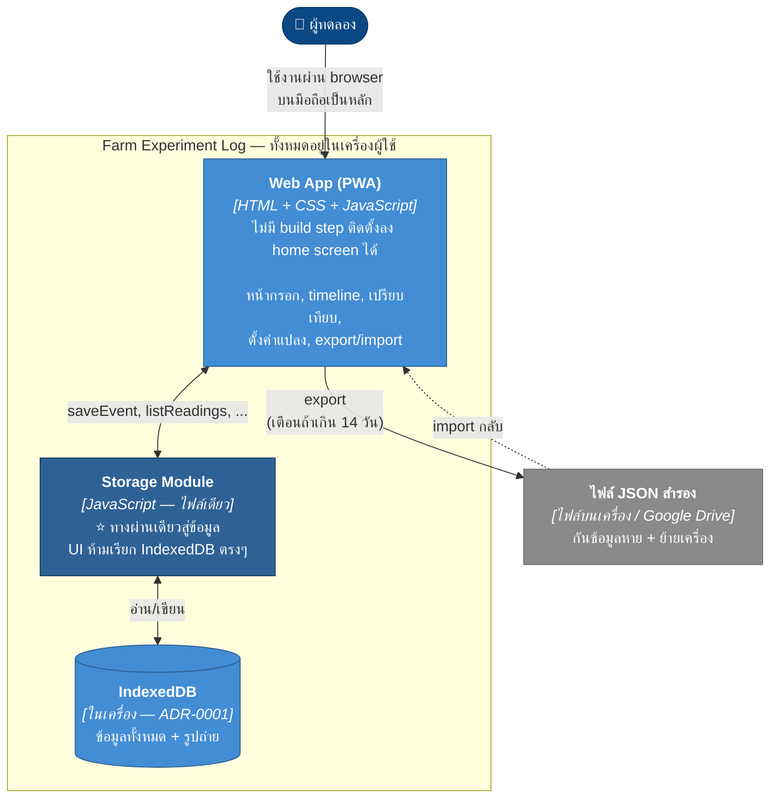
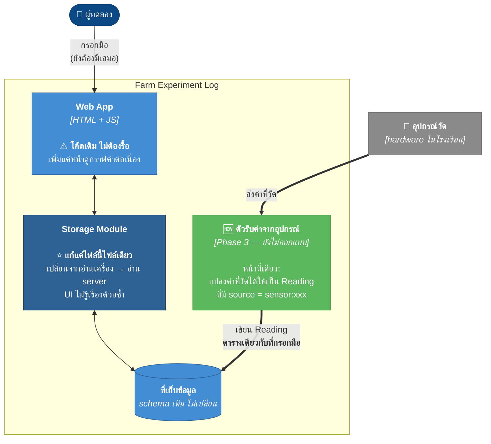
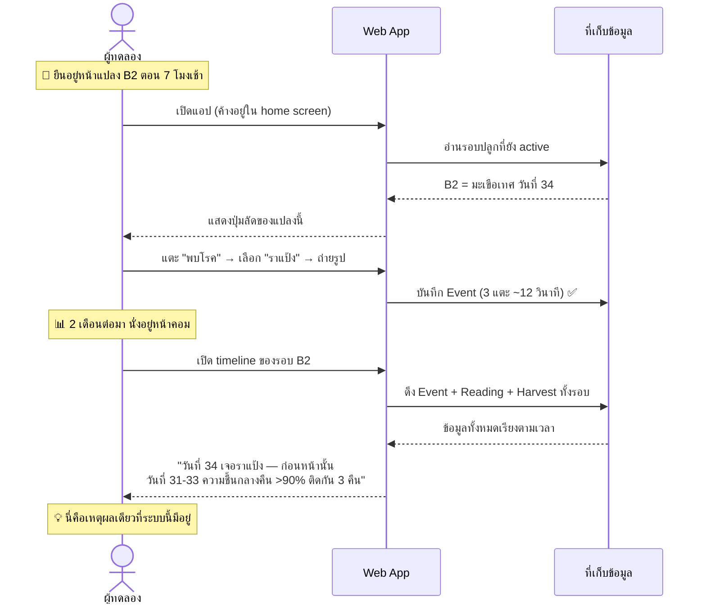
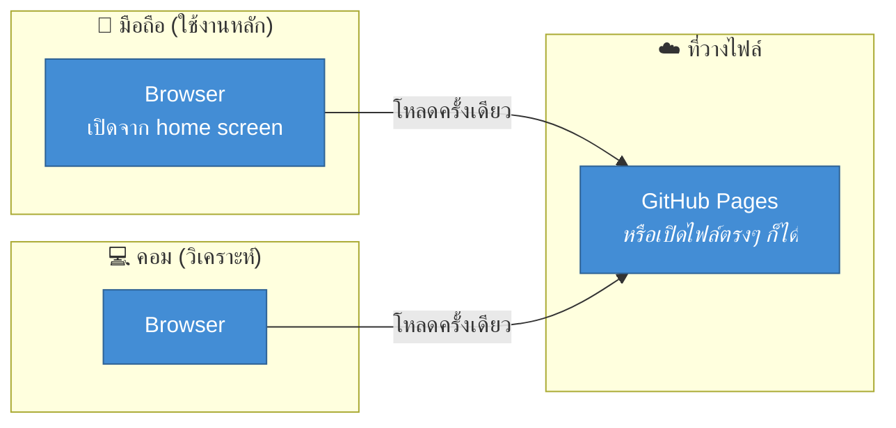

# 02 — Container (C4 Level 2)

> สถานะ: 🟢 ตกลงแล้ว — ที่เก็บข้อมูลตัดสินใจแล้วตาม [ADR-0001](adr/0001-data-storage.md)
> ตอบคำถาม: **ระบบแยกเป็นกี่ส่วนที่รันแยกกัน แต่ละส่วนทำอะไร และข้อมูลอยู่ที่ไหน**

"Container" ใน C4 = สิ่งที่ **รันแยกกันได้และ deploy แยกกันได้** เช่น เว็บแอป, ฐานข้อมูล, mobile app, service — ไม่ใช่ Docker container

---

## 1. วันนี้ (Phase 2)

**มี container เดียวจริงๆ** — ที่เหลืออยู่ในเครื่องเดียวกันทั้งหมด นี่คือสถาปัตยกรรมที่เรียบง่ายที่สุดเท่าที่จะเป็นไปได้ และเป็นเรื่องดี

### ⭐ Storage Module — กล่องที่ดูเหมือนไม่จำเป็น แต่จำเป็น

ปกติการแยก layer แบบนี้ในโปรเจกต์เล็กคือ over-engineering แต่เคสนี้ **เรารู้ล่วงหน้าแน่ๆ ว่าจะต้องเปลี่ยน** (Phase 3 ต้องมี server ดู ADR-0001) และมันเป็นโค้ดแค่ไฟล์เดียว จึงคุ้ม

กฎเดียวที่ต้องรักษา: **โค้ดส่วน UI ห้ามมีคำว่า `indexedDB` อยู่เลย** ถ้ามีเมื่อไหร่ แปลว่าเริ่มรั่วแล้ว

### ทำไมถึงเป็น HTML ไฟล์เดียว ไม่มี build step

| เหตุผล | ผลที่ได้ |
|---|---|
| ตรงกับที่ repo นี้ทำอยู่แล้ว | `04-house-zone-3d.html` เป็น HTML เดียว 50KB ที่ทำ 3D ได้ — พิสูจน์แล้วว่าพอ |
| ไม่มี npm / node_modules / build | เปิดไฟล์แล้วทำงานทันที ทั้งวันนี้และอีก 3 ปี |
| ไม่มีอะไรให้เน่า | โปรเจกต์ส่วนตัวที่ไม่ได้แตะ 6 เดือน แล้วกลับมา `npm install` ไม่ผ่าน คือสาเหตุที่โปรเจกต์ตาย |
| deploy = copy ไฟล์ | วางบน GitHub Pages หรือเปิดจากไฟล์ตรงๆ ก็ได้ |

**ข้อแลกเปลี่ยนที่ยอมรับ:** ไม่มี framework, ไม่มี type checking, ไฟล์จะยาวขึ้นเรื่อยๆ → ถ้าเกิน ~2,000 บรรทัดค่อยแตกเป็นหลายไฟล์ (ยังไม่ต้อง build ก็ทำได้ด้วย ES modules)

### กล่องสีแดง — สิ่งที่ยังตอบไม่ได้

ที่เก็บข้อมูลคือการตัดสินใจที่ **กลับยากที่สุด** ในระบบนี้ เพราะมันกำหนดว่า:
- กรอกจากมือถือแล้วดูจากคอมได้ไหม
- ข้อมูลหายง่ายแค่ไหน
- ตอน sensor เข้ามาใน Phase 3 มันจะเขียนข้อมูลเข้าตรงไหน

→ **ยังไม่ตัดสิน รอคุยกัน** รายละเอียดตัวเลือกและข้อแลกเปลี่ยนอยู่ใน [ADR-0001](adr/0001-data-storage.md)

---

## 2. อนาคต (Phase 3 — เมื่อมี sensor)

### สิ่งที่เปลี่ยนตอน sensor เข้ามา

| ส่วน | เปลี่ยนไหม |
|---|---|
| schema ข้อมูล | ❌ ไม่เปลี่ยน |
| ข้อมูลเก่าที่กรอกมือไว้ 1 ปี | ❌ ใช้ต่อได้ทันที ไม่ต้อง migrate |
| หน้ากรอกมือ | ❌ ไม่เปลี่ยน (ยังต้องมี — sensor วัด "เห็นเพลี้ยที่ใบล่าง" ไม่ได้) |
| หน้า timeline / เปรียบเทียบ | ⚠️ เปลี่ยนเล็กน้อย — ข้อมูลถี่ขึ้นมาก ต้องมีการสรุปเป็นราย ชม./วัน |
| Storage Module | ⚠️ **แก้ไฟล์เดียว** — เปลี่ยนจากอ่าน IndexedDB เป็นอ่าน server (นี่คือเหตุผลที่มันมีอยู่) |
| **ตัวรับค่าจากอุปกรณ์** | 🆕 **กล่องใหม่ 1 กล่อง — นี่คือทั้งหมดที่เพิ่ม** |

**นี่คือคำตอบของคำถามที่ตั้งไว้ใน [README](README.md):** *"ตอน sensor เข้ามาในอีก 1 ปี ต้องรื้ออะไรบ้าง"* → ไม่ต้องรื้ออะไร เพิ่มกล่องเดียว

**เงื่อนไขเดียวที่ทำให้เป็นจริง:** ต้องมี field `source` ใน Reading **ตั้งแต่วันแรก** ทั้งที่ยังไม่มี sensor — เป็น field ที่ดูเหมือนไร้ประโยชน์ตอนนี้ (ค่าเป็น `manual` หมดทุกแถว) แต่คือสิ่งเดียวที่กันการรื้อระบบในอนาคต

---

## 3. Dynamic view — use case ที่สำคัญที่สุด

C4 มีไดอะแกรมเสริมชื่อ *Dynamic diagram* ไว้แสดงลำดับการทำงาน อันนี้คือ use case ที่ระบบทั้งหมดมีอยู่เพื่อรองรับ:

ลำดับนี้คือที่มาของ requirement ทุกข้อ:
- **แตะ 3 ครั้งจบ** → หน้ากรอกต้องรู้ context เองว่าอยู่แปลงไหน รอบไหน วันที่เท่าไหร่ของรอบ
- **ข้อมูล 2 เดือนก่อนต้องยังอ่านรู้เรื่อง** → ต้องเก็บ "รอบปลูก" เป็นหน่วยหลัก ไม่ใช่แค่ log เรียงตามเวลา
- **เอา Event มาวางเทียบกับ Reading บนแกนเวลาเดียวกันได้** → ทั้งสองต้องผูกกับแปลงและเวลาในรูปแบบเดียวกัน

---

## 4. Deployment — ของจริงรันอยู่บนอะไร

**ข้อสังเกตที่ต้องยอมรับ:** มือถือกับคอมเป็น **2 ชุดข้อมูลที่ไม่คุยกัน** — ย้ายข้อมูลข้ามกันได้ทางเดียวคือ export/import JSON ด้วยมือ นี่คือราคาที่จ่ายตาม [ADR-0001](adr/0001-data-storage.md) และเป็นเรื่องที่ต้องรู้ตัวก่อนเริ่มใช้ ไม่ใช่ค่อยไปเจอเอาทีหลัง

**ทางปฏิบัติที่แนะนำ:** ให้ **มือถือเป็นต้นฉบับ** (ที่ที่ข้อมูลเกิด) แล้ว export ไปเปิดบนคอมตอนจะวิเคราะห์ — ห้ามกรอกข้อมูลจากทั้งสองเครื่อง เพราะจะได้ 2 ชุดที่ merge กันไม่ได้

---

## ถัดไป

→ [03-data-model.md](03-data-model.md) — Entity, field, ความสัมพันธ์
