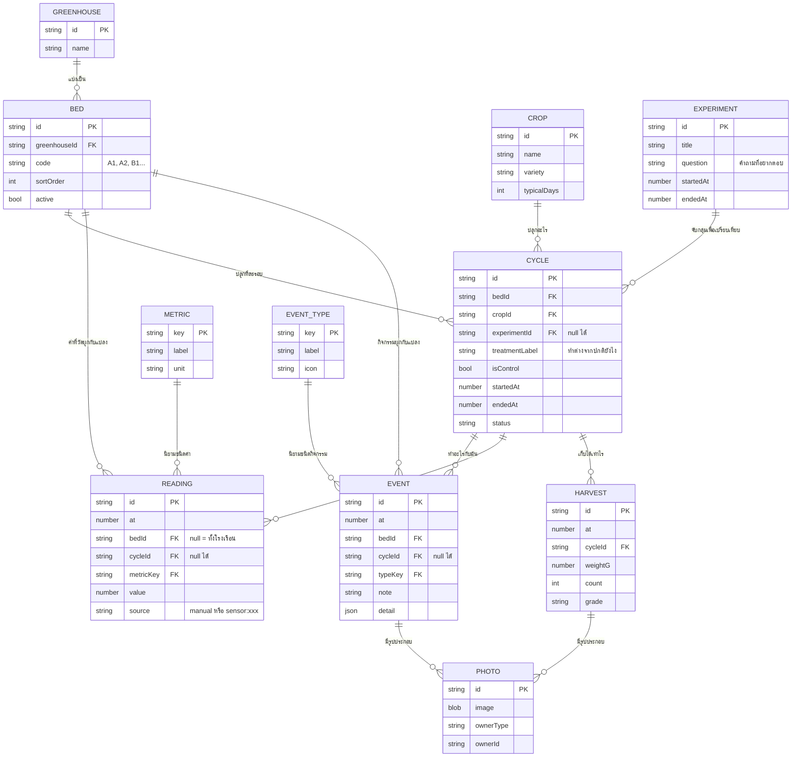

# 03 — Data Model

> สถานะ: 🟡 ร่าง
> ตอบคำถาม: **เก็บอะไรบ้าง แต่ละอย่างมี field อะไร และเชื่อมกันยังไง**
> อิงการตัดสินใจจาก [ADR-0001](adr/0001-data-storage.md) — เก็บใน IndexedDB ในเครื่อง

---

## 1. ภาพรวม



---

## 2. การตัดสินใจสำคัญ 8 ข้อ และเหตุผล

### 2.1 ⭐ Cycle (รอบปลูก) คือแกนกลาง ไม่ใช่ Bed

ระบบบันทึกฟาร์มส่วนใหญ่เก็บเป็น log เรียงตามเวลา — ผลคือเปิดดูย้อนหลังแล้วเห็นเป็นกองข้อมูลที่ไม่มีความหมาย

ที่นี่ **"รอบปลูก" คือหน่วยหลัก** เพราะคำถามที่ระบบมีอยู่เพื่อตอบคือ *"ทำไม**รอบนั้น**ถึงได้ผลดีกว่า"* พอมี Cycle เป็นแกน จะได้ของ 3 อย่างฟรีๆ:

- **"วันที่ 34 ของรอบ"** แทน "8 สิงหาคม" ← พืชไม่สนใจปฏิทิน มันสนใจว่าอายุกี่วัน และนี่คือสิ่งที่ทำให้เทียบข้ามรอบได้
- ขอบเขตที่ชัดเจนของสิ่งที่ต้องดูตอนวิเคราะห์
- สรุปผลได้เป็นก้อน (รอบนี้ลงทุนเท่าไร เก็บได้เท่าไร)

### 2.2 Experiment แยกจาก Cycle

Experiment = คำถาม 1 ข้อ, Cycle = แปลง 1 แปลงในคำถามนั้น

```
Experiment: "ให้น้ำ 2 ครั้ง/วัน ดีกว่า 1 ครั้ง/วันไหม"
  ├─ Cycle: A1 มะเขือเทศ  treatment="1 ครั้ง/วัน"  isControl=true
  ├─ Cycle: A2 มะเขือเทศ  treatment="1 ครั้ง/วัน"  isControl=true
  ├─ Cycle: B1 มะเขือเทศ  treatment="2 ครั้ง/วัน"
  └─ Cycle: B2 มะเขือเทศ  treatment="2 ครั้ง/วัน"
```

โครงสร้างนี้บังคับกฎการทดลองจาก [00-concept.md](00-concept.md) §6 ให้เกิดขึ้นเองโดยไม่ต้องท่อง — พอสร้าง Experiment แล้วมี Cycle เดียว หรือไม่มี `isControl` เลย ระบบเตือนได้ทันทีว่านี่ยังไม่ใช่การทดลอง

**`experimentId` เป็น null ได้** เพราะการปลูกส่วนใหญ่คือปลูกกินปลูกขายเฉยๆ ไม่ได้ทดลองอะไร — และการบังคับให้ทุกอย่างเป็นการทดลองจะทำให้คนเลิกกรอก

### 2.3 ⭐ Event กับ Reading แยกกัน

| | Event | Reading |
|---|---|---|
| คืออะไร | **สิ่งที่เราทำ / สิ่งที่เราเห็น** | **ตัวเลขที่วัดได้** |
| ตัวอย่าง | รดน้ำ, ให้ปุ๋ย, ตัดแต่ง, เจอราแป้ง | 36.5 °C, 92 %RH, pH 6.2 |
| ค่า | เป็นข้อความ/โครงสร้างอิสระ | เป็นตัวเลข + หน่วยเสมอ |
| เอาไปทำอะไร | หมุดบนแกนเวลา | **พล็อตกราฟ / หาค่าเฉลี่ย / เทียบแปลง** |
| ที่มา | คนเท่านั้น | **คน หรือ sensor** |

**เหตุผลที่ต้องแยก:** Reading ต้องเป็นตัวเลขล้วนถึงจะคำนวณได้ ส่วน Event เป็นอะไรก็ได้ ถ้ายัดรวมกันเป็นตารางเดียวจะได้ตารางที่ครึ่งหนึ่งของแถวคำนวณไม่ได้ และตอน sensor เข้ามาจะปนกันมั่ว

**และนี่คือสิ่งที่ทำให้ use case หลักเป็นจริง** — เอา Event ("เจอราแป้ง วันที่ 34") ไปวางทับกราฟ Reading (ความชื้นกลางคืน วันที่ 31–33) บนแกนเวลาเดียวกัน แล้วเห็นความสัมพันธ์

### 2.4 ⭐⭐ `source` ใน Reading — field ที่สำคัญที่สุดในระบบ

```js
{ at: 1786000000000, bedId: "bed_a1", metricKey: "temp", value: 36.5, source: "manual" }
{ at: 1786000000000, bedId: "bed_a1", metricKey: "temp", value: 36.5, source: "sensor:th-01" }
```

สองแถวนี้อยู่ในตารางเดียวกัน query เดียวกัน กราฟเดียวกัน

วันนี้ทุกแถวจะเป็น `manual` หมด **ดูเหมือน field ที่ไร้ประโยชน์สิ้นดี** — แต่มันคือสิ่งเดียวที่ทำให้ข้อมูลที่กรอกมือไว้ 1 ปี ยังใช้เทียบกับข้อมูล sensor ได้ในวันที่ Phase 3 มาถึง โดยไม่ต้อง migrate ไม่ต้องแยกตาราง (ดู [02-container.md](02-container.md) §2)

**ราคาของ field นี้วันนี้: 1 บรรทัด | ราคาถ้าไม่ใส่แล้วต้องเพิ่มทีหลัง: migrate ข้อมูลทั้งหมด + แก้ทุก query**

### 2.5 Metric และ EventType เป็น "ข้อมูล" ไม่ใช่ enum ในโค้ด

```js
// ❌ ห้ามทำ — ล็อกไว้ในโค้ด
const METRICS = ['temp', 'humidity', 'ph']

// ✅ เก็บเป็นข้อมูลที่ผู้ใช้เพิ่มเองได้
{ key: 'temp', label: 'อุณหภูมิ', unit: '°C', min: 0, max: 60, decimals: 1 }
```

**เหตุผลตรงๆ: โรงเรือนยังไม่ชัวร์** ([README](README.md) §หลักการ) ตอนนี้ยังไม่รู้ด้วยซ้ำว่าจะวัดอะไรบ้าง ถ้า hardcode ไว้ พอถึงหน้างานอยากวัด "ความสูงต้น" หรือ "จำนวนดอกที่ติด" จะต้องกลับมาแก้โค้ด — ซึ่งแปลว่าจะไม่ได้วัด

มี**ค่าตั้งต้น**ให้เลือกได้ตอนติดตั้งครั้งแรก แต่แก้ได้หมด

### 2.6 id เป็น string ที่สุ่มมา ไม่ใช่เลขรันนิ่ง

ใช้ `crypto.randomUUID()` (มีในทุก browser สมัยใหม่ ไม่ต้องลง library)

**เหตุผล:** เลขรันนิ่งจะชนกันทันทีที่มีข้อมูลจาก 2 เครื่อง — ซึ่งจะเกิดตอน import ไฟล์ export จากมือถือเข้าคอม (ซึ่งเป็นวิธีทำงานปกติตาม ADR-0001) และจะเกิดหนักกว่าตอน Phase 3

### 2.7 เวลาเก็บเป็น epoch milliseconds

`at: 1786000000000` ไม่ใช่ `"2026-08-08 07:12"`

**เหตุผล:** IndexedDB ทำ index แบบช่วง (`IDBKeyRange`) กับตัวเลขได้ตรงๆ ซึ่งเป็น query หลักของระบบ ("ขอทุกอย่างของแปลง A1 ในรอบนี้") ส่วนการแสดงผลค่อยแปลงเป็นเวลาไทยตอนวาดหน้าจอ

**ข้อควรระวัง:** `dayOfCycle` (วันที่เท่าไรของรอบ) **ไม่เก็บ** — คำนวณจาก `at - cycle.startedAt` ทุกครั้ง ถ้าเก็บไว้แล้ววันเริ่มรอบถูกแก้ทีหลัง ข้อมูลจะขัดกันเองทันที

### 2.8 ลบแบบ soft delete (`deletedAt`)

ทุก entity มี `deletedAt: number | null` — การลบคือใส่เวลาลงไป ไม่ใช่ลบทิ้งจริง

**เหตุผล 2 ข้อ:**
1. **นิ้วเปียกในโรงเรือนกลางแดด** — กดผิดง่ายมาก และข้อมูลที่หายไปคือข้อมูลที่กู้ไม่ได้
2. ตอน Phase 3 ทำ sync การลบจริงจะทำให้ข้อมูลที่ลบแล้ว "ฟื้น" กลับมาจากเครื่องอื่นเสมอ

---

## 3. Object stores และ index ใน IndexedDB

| Store | keyPath | Index ที่ต้องมี | ใช้ทำอะไร |
|---|---|---|---|
| `greenhouses` | id | — | |
| `beds` | id | `greenhouseId`, `sortOrder` | เรียงแปลงในหน้าหลัก |
| `crops` | id | `name` | |
| `experiments` | id | `startedAt` | |
| `cycles` | id | `bedId`, `status`, `experimentId` | **หา cycle ที่ active ของแปลงนี้** ← query ที่ใช้บ่อยที่สุด |
| `events` | id | `cycleId`, `[bedId+at]`, `at` | timeline |
| `readings` | id | `[metricKey+at]`, `[bedId+at]`, `cycleId` | กราฟ + เทียบแปลง |
| `harvests` | id | `cycleId`, `at` | สรุปผลผลิตรายรอบ |
| `photos` | id | `ownerId` | เก็บ blob แยก store เพื่อไม่ให้ store อื่นอืด |
| `metrics` | key | — | dictionary |
| `eventTypes` | key | — | dictionary |
| `meta` | key | — | `schemaVersion`, `lastExportAt` |

**Compound index `[bedId+at]`** คือหัวใจ — ทำให้ดึง "ทุกอย่างของแปลง A1 ระหว่างวันที่ X ถึง Y" ได้โดยไม่ต้องอ่านทั้ง store

**แยก `photos` เป็น store ของตัวเอง** เพราะรูปเป็น blob ขนาดหลาย MB ถ้าอยู่ปนกับ event จะทำให้การอ่าน timeline (ที่ยังไม่ต้องใช้รูป) ช้าลงมาก

---

## 4. ตัวอย่างจริง — use case จาก [02-container.md](02-container.md) §3

**7 โมงเช้า ยืนหน้าแปลง B2 แตะ 3 ครั้ง:**

```js
// Event ที่เกิดจากการแตะ 3 ครั้ง (~12 วินาที)
{
  id: "evt_9f3a...", at: 1786...,
  bedId: "bed_b2",
  cycleId: "cyc_7c21...",        // แอปรู้เอง ไม่ต้องเลือก
  typeKey: "disease",
  detail: { disease: "ราแป้ง", severity: "เริ่มพบ", position: "ใบล่าง" },
  note: "",
  deletedAt: null
}
// + Photo 1 รูป ที่ ownerType="event", ownerId="evt_9f3a..."
```

**2 เดือนต่อมา หน้า timeline ของ cycle นี้ดึง:**

```js
events   .index("cycleId").getAll("cyc_7c21...")
readings .index("cycleId").getAll("cyc_7c21...")
harvests .index("cycleId").getAll("cyc_7c21...")
```

รวมสามอันเรียงตาม `at` แล้วคำนวณ `dayOfCycle` → ได้ภาพที่ทำให้เห็นว่า **"วันที่ 34 เจอราแป้ง — ก่อนหน้านั้นวันที่ 31–33 ความชื้นกลางคืน >90% ติดกัน 3 คืน"**

นี่คือเหตุผลเดียวที่ระบบนี้มีอยู่ และทุกการตัดสินใจใน §2 มีไว้เพื่อให้บรรทัดนี้เป็นจริง

---

## 5. รูปแบบไฟล์ export

```json
{
  "format": "farm-experiment-log",
  "schemaVersion": 1,
  "exportedAt": 1786000000000,
  "exportedFrom": "iPhone-Safari",
  "data": {
    "greenhouses": [], "beds": [], "crops": [],
    "experiments": [], "cycles": [],
    "events": [], "readings": [], "harvests": [],
    "metrics": [], "eventTypes": []
  },
  "photos": "แยกไฟล์ zip ต่างหาก (ดูด้านล่าง)"
}
```

**รูปไม่รวมในไฟล์ JSON** — ถ้ารวมด้วย base64 ไฟล์จะใหญ่ระดับร้อย MB จนเปิดไม่ไหว ให้ export รูปแยกเป็น zip หรือข้ามไปก่อนใน v1 (รูปยังอยู่ในเครื่อง)

**`schemaVersion`** ต้องมีตั้งแต่ไฟล์แรก เพื่อให้เวอร์ชันอนาคตรู้ว่าต้องแปลงข้อมูลเก่ายังไง — เป็นอีก field ที่ราคาวันนี้เท่ากับ 1 บรรทัด

---

## 6. สิ่งที่ **ไม่** อยู่ใน model นี้ (และทำไม)

| ไม่มี | เหตุผล |
|---|---|
| ต้นทุน / ราคา / กำไร | คำนวณจาก Harvest + Event ได้ทีหลัง ไม่ต้องเป็น entity — จะกลับมาใน Phase 4 |
| ผู้ใช้ / สิทธิ์ | ปีแรกมีคนเดียว ([ADR-0001](adr/0001-data-storage.md) ข้อสมมติ 3) |
| สต๊อกวัสดุ | ระบบของตัวเองที่ใหญ่พอๆ กับตัวหลัก |
| ต้นไม้รายต้น | ระดับรายละเอียดที่เกินกว่าจะกรอกไหวจริงในโรงเรือน 72 ตร.ม. — ถ้าจำเป็นค่อยเพิ่มทีหลัง |
| ตำแหน่ง x,y ของแปลง | ยังไม่รู้ผังโรงเรือนจริง ([00-concept.md](00-concept.md) ยังเป็นร่าง) — `sortOrder` พอสำหรับตอนนี้ |

---

## ถัดไป

→ 04-screens.md — หน้าจอและ user flow (ยังไม่เขียน)
→ จากนั้นลงมือทำ `src/smartfarm/01-farm-log.html`
