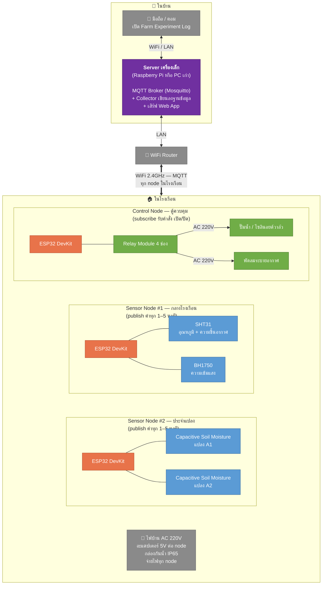
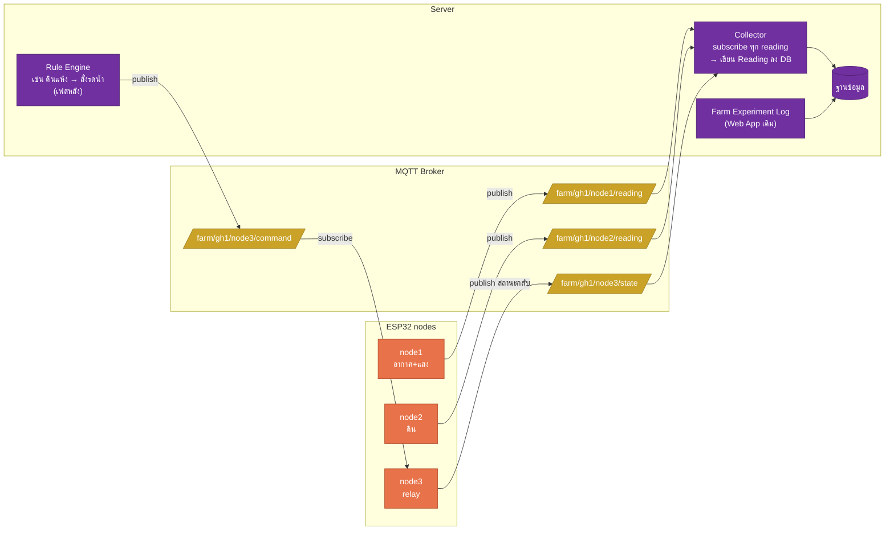
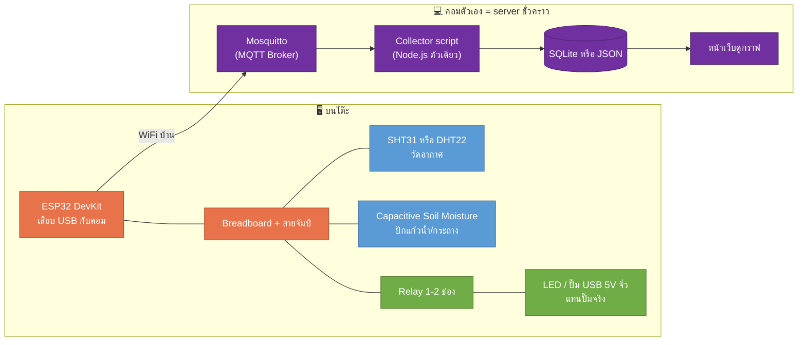

# 04 — IoT Architecture (ฮาร์ดแวร์และการเชื่อมต่อ)

> สถานะ: 🟡 ร่าง
> ตอบคำถาม: **ใช้บอร์ดอะไร ต่อกับอะไร ส่วนไหนอยู่ในโรงเรือน คุยกันผ่านอะไร ไฟมาจากไหน**
> ข้อกำหนดตั้งต้น: โรงเรือนมี **WiFi ถึง** และ **ไฟบ้าน (AC 220V)** — แหล่งพลังงาน/การเชื่อมต่ออื่น (โซลาร์, LoRa, 4G) เป็นเรื่องอนาคต
> เป้าหมายตอนนี้: **ซื้อฮาร์ดแวร์มาลอง dev บนโต๊ะก่อน** โรงเรือนจริงยังไม่ต้องมี

---

## 1. ภาพรวมระบบเต็ม (โรงเรือนจริงในอนาคต)



### หลักการที่กำหนดรูปนี้

| หลักการ | เหตุผล |
|---|---|
| **หลาย node เล็ก ไม่ใช่ node เดียวใหญ่** | สายวัดดิน 10 เมตรลากข้ามโรงเรือนคือ noise และจุดพัง — ให้ node อยู่ใกล้จุดวัด แล้วส่งไร้สายแทน |
| **แยก node วัด กับ node ควบคุม** | node วัดพังไม่เป็นไรแค่ข้อมูลหาย แต่ relay ที่คุมปั๊มพังคือน้ำท่วม/ต้นแห้งตาย จึงแยกกันเพื่อไม่ให้ล้มพร้อมกัน |
| **สมองอยู่ที่ server ไม่ใช่ ESP32** | ESP32 ทำหน้าที่โง่ที่สุด: อ่านค่า-ส่ง, รับสั่ง-สับ relay — logic เช่น "ความชื้นต่ำให้รดน้ำ" อยู่บน server ที่แก้โค้ดง่าย ไม่ต้องปีนไป flash ในโรงเรือน |
| **ESP32 ทำงานต่อได้แม้ server ตาย** | ตั้ง failsafe ในบอร์ด: ถ้าขาดการติดต่อ ให้รดน้ำตามตารางเวลา fallback — ระบบเน่าแล้วพืชต้องไม่ตาย |
| **MQTT เป็นภาษากลาง** | โปรโตคอลมาตรฐาน IoT — เพิ่ม node ใหม่ = ตั้ง topic ใหม่ ไม่ต้องแก้อะไรที่มีอยู่ |

### จุดเชื่อมกับเอกสารเดิม

**Collector ใน [02-container.md](02-container.md) §2 = MQTT Broker + ตัว subscribe ที่เขียนลงฐานข้อมูล** — ค่าที่เข้ามาถูกแปลงเป็น `Reading { source: "sensor:node1-sht31" }` ตาม schema ใน [03-data-model.md](03-data-model.md) §2.4 ทุกอย่างที่ออกแบบไว้ใช้ต่อได้หมด

> ⚠️ **หมายเหตุเรื่อง ADR-0001:** สถาปัตยกรรมเต็มรูปนี้มี server กลาง แปลว่าเมื่อไปถึงจุดที่ติดตั้งจริงในโรงเรือน จะเข้าเงื่อนไข "เปิด ADR-0002" (มี Phase 3) — แต่**ชุดโต๊ะทดลองด้านล่างยังไม่แตะเรื่องนี้** เพราะแค่ dev บนโต๊ะ ใช้คอมตัวเองเป็น server ชั่วคราวได้เลย

---

## 2. Topology ตรรกะ — ใครคุยกับใคร ผ่าน topic อะไร



**payload ตัวอย่าง** (JSON ตรงกับ Reading ใน data model):

```json
{ "node": "node1", "metric": "temp", "value": 36.5, "ts": 1786000000 }
```

---

## 3. 🛒 ชุดโต๊ะทดลอง — ของที่ซื้อจริงรอบแรก

**เป้าหมาย: จบบนโต๊ะตัวเดียว งบหลักร้อยถึงพันต้นๆ พิสูจน์เส้นทางข้อมูลครบทั้งเส้น** (sensor → ESP32 → WiFi → MQTT → DB → เห็นบนหน้าเว็บ)



### รายการซื้อ (หาได้ใน Shopee/Lazada คำค้นตามชื่อในตาราง)

| # | ของ | ราคาโดยประมาณ | หมายเหตุ |
|---|---|---|---|
| 1 | **ESP32 DevKit V1 (38 pin)** × 2 | ~120–180.-/ตัว | ซื้อ 2 เผื่อตัวหนึ่งพัง และไว้ลอง 2 node คุยกัน |
| 2 | **SHT31 module** (หรือ DHT22 ถ้าประหยัด) | ~80–150.- | SHT31 แม่นกว่า DHT22 มากและทนชื้นกว่า — ถ้าตั้งใจใช้ยาวเอา SHT31 |
| 3 | **Capacitive Soil Moisture v1.2** × 2 | ~25–50.-/ตัว | **ต้อง capacitive เท่านั้น** แบบ resistive (ก้านส้อมเปลือย) กร่อนพังใน 2 สัปดาห์ |
| 4 | **BH1750 (วัดแสง)** | ~40–60.- | ไม่บังคับรอบแรก แต่ถูกและต่อ I2C สายเดียวกับ SHT31 |
| 5 | **Relay module 2 ช่อง (5V, optocoupler)** | ~40–60.- | รอบแรกให้สับ LED/ปั๊ม USB พอ **ห้ามแตะ AC 220V บนโต๊ะ** |
| 6 | **ปั๊มน้ำ USB 5V จิ๋ว + สายยาง** | ~50–80.- | ไว้ทำ demo รดน้ำจริงจากแก้วน้ำ สนุกและเห็นภาพ |
| 7 | Breadboard + สายจัมป์ผู้-เมีย/ผู้-ผู้ | ~60–100.- | |
| 8 | สาย Micro-USB ดีๆ 1 เส้น | ~50.- | สายชาร์จถูกๆ บางเส้นไม่มีสาย data — flash ไม่ได้ งงกันมานักต่อนัก |

**รวม ~500–800 บาท** — ฝั่ง software บนคอม (Mosquitto, Node.js, SQLite) ฟรีทั้งหมด ไม่ต้องซื้อ Raspberry Pi ตอนนี้ (แพงเกินหน้าที่มันทำในเฟสนี้ — คอมตัวเองแทนได้ 100%)

### สิ่งที่ต้องรู้ก่อนเริ่ม (บทเรียนที่คนเจอกันทุกคน)

1. **ESP32 ต่อ WiFi ได้เฉพาะ 2.4GHz** — ถ้า router ตั้งชื่อ SSID 5GHz กับ 2.4GHz เป็นชื่อเดียวกัน อาจต่อไม่ติด ให้แยกชื่อหรือปิด band steering ชั่วคราว
2. **Soil moisture แบบ analog อ่านค่าดิบ 0–4095** — ต้อง calibrate เอง 2 จุด: ค่ากลางอากาศ (แห้งสุด) กับค่าจุ่มน้ำ (เปียกสุด) แล้ว map เป็น %
3. **Relay ฝั่งคอยล์กินไฟพอควร** — ถ้าต่อหลาย relay อย่าดึงไฟจากขา 3V3 ของ ESP32 ให้ใช้ 5V จาก USB
4. **DHT22 อ่านได้ช้าสุดทุก 2 วินาที** และค่าเพี้ยนง่ายเมื่อสายยาว — อีกเหตุผลที่ SHT31 (I2C) ดีกว่า

---

## 4. เฟสการทดลอง dev (ไม่ผูกกับเฟสโรงเรือนใน 00-concept)

| เฟส dev | ทำอะไร | พิสูจน์อะไร |
|---|---|---|
| **D1 — Hello sensor** | ESP32 อ่าน SHT31 print ออก Serial Monitor | ต่อวงจรเป็น flash เป็น |
| **D2 — ขึ้น WiFi + MQTT** | publish ค่าขึ้น Mosquitto บนคอม ดูด้วย MQTT Explorer | เส้นทางไร้สายทำงาน |
| **D3 — Collector + เก็บลง DB** | script subscribe แล้วเขียนเป็น `Reading { source: "sensor:..." }` ตาม [03-data-model.md](03-data-model.md) | **schema ที่ออกแบบไว้รับข้อมูลจริงได้** ← จุดสำคัญสุด |
| **D4 — ดูกราฟ** | หน้าเว็บ query จาก DB วาดกราฟอุณหภูมิย้อนหลัง | เห็นค่าครบทั้งเส้นทาง |
| **D5 — สั่งงานย้อนกลับ** | ปุ่มบนหน้าเว็บ → MQTT command → relay สับ → ปั๊ม USB รดน้ำแก้ว | เส้นทางควบคุมทำงาน |
| **D6 — ความทนทาน** | ปล่อยรัน 7 วัน: ถอด router, ดับคอม, ดูว่า ESP32 reconnect เองไหม ข้อมูลช่วงขาดหายยังไง | ของที่จะเอาไปไว้กลางแดดต้องเลี้ยงตัวเองได้ |

จบ D6 = รู้ครบทุกอย่างที่ต้องรู้ก่อนตัดสินใจซื้อของจริงชุดโรงเรือน (กล่องกันน้ำ, สายไฟ outdoor, ปั๊มจริง)

---

## 5. สิ่งที่ตัดสินใจแล้ว / ยังไม่ตัดสินใจ ในเอกสารนี้

**ตัดสินใจแล้ว (สำหรับชุดโต๊ะ):**
- บอร์ด: **ESP32** — WiFi ในตัว, ราคา ~150.-, ecosystem ใหญ่สุด, ADC เยอะพอ (Arduino Uno ไม่มี WiFi ต้องซื้อ shield เพิ่มแพงกว่า / Raspberry Pi Pico W ก็ได้แต่ชุมชนฝั่งเกษตรเล็กกว่า)
- โปรโตคอล: **MQTT**
- server ช่วง dev: **คอมตัวเอง**

**ยังไม่ตัดสินใจ (ค่อยตัดสินตอนจะติดตั้งจริง — และควรเปิดเป็น ADR ตอนนั้น):**
- firmware เขียนด้วยอะไร (Arduino C++ / ESPHome / MicroPython) — ลองใน D1 แล้วค่อยเลือกที่ถนัด
- server จริงในบ้านเป็นอะไร (Raspberry Pi / mini PC / NAS)
- ฐานข้อมูลฝั่ง server (SQLite พอ หรือขยับเป็น time-series DB)
- การเชื่อม Web App (PWA เดิมตาม ADR-0001) เข้ากับ server — จะกลายเป็น ADR-0002

---

## ถัดไป

→ เริ่ม D1 ได้ทันทีที่ของมาส่ง — โค้ดตัวอย่างจะอยู่ใน `src/smartfarm/`
→ 05-screens.md — หน้าจอ Web App (เลื่อนลำดับจากเดิมที่เป็น 04)
