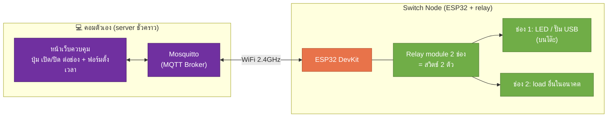

# 01 — Design: สวิตช์ไฟสั่งงานระยะไกล

> สถานะ: 🟡 ร่าง
> ตอบคำถาม: **ใช้ของอะไรบ้าง คุยกันยังไง ตั้งเวลาเก็บไว้ที่ไหน ทำทีละขั้นยังไง**

---

## 1. ภาพรวม

มองทั้งกล่องเป็น **สวิตช์อัจฉริยะ n ช่อง**: relay 1 ช่อง = สวิตช์ 1 ตัว
ปลายทางเสียบอะไรก็ได้ — ปั๊มน้ำ พัดลม ไฟส่องต้นไม้ — design ไม่ผูกกับ load

หลักการเดิมจาก [04-iot-architecture.md](../../docs/smartfarm/04-iot-architecture.md) ที่ยังคุมอยู่:
- ESP32 ทำหน้าที่โง่ที่สุด: รับสั่ง → สับ relay → รายงานสถานะกลับ
- **ยกเว้นเรื่องเดียว: ตารางเวลาอยู่บน ESP32** (ดู §3) เพราะสวิตช์ต้องทำงานตามเวลาต่อได้แม้คอม/broker ดับ — ตรงกับหลัก failsafe ในเอกสาร 04

---

## 2. MQTT Topics

ใช้ชื่อ topic ตาม convention เดิม (`farm/gh1/node3/...`) เพื่อให้ตอนรวมกลับเข้าระบบใหญ่ไม่ต้องเปลี่ยนอะไร — สวิตช์ระบุด้วยเลขช่อง (`ch`)

| Topic | ทิศทาง | payload ตัวอย่าง |
|---|---|---|
| `farm/gh1/node3/command` | server → ESP32 | `{ "ch": 1, "action": "on" }` / `"off"` |
| `farm/gh1/node3/schedule` | server → ESP32 | `{ "ch": 1, "on": "06:00", "off": "06:15", "enabled": true }` |
| `farm/gh1/node3/state` | ESP32 → server | `{ "ch": 1, "state": "on", "by": "schedule", "ts": 1786000000 }` |

- `state` ส่งทุกครั้งที่สวิตช์เปลี่ยนสถานะ + ส่งซ้ำเป็นระยะ (heartbeat) เพื่อให้หน้าเว็บรู้ว่า node ยังอยู่
- `by` บอกว่าใครสั่ง: `"manual"` (คนกด) หรือ `"schedule"` (ตามเวลา) — เผื่อดูย้อนหลัง

---

## 3. ตั้งเวลา — เก็บไว้ที่ไหน

**ตัดสินใจ: ตารางเวลาเก็บใน ESP32 (flash/NVS) ไม่ใช่บน server**

| ทางเลือก | ข้อดี | ข้อเสีย | เลือกไหม |
|---|---|---|---|
| server สั่งตามเวลา | แก้ logic ง่าย | คอมดับ = สวิตช์ไม่ทำงานตามเวลา | ❌ |
| **ESP32 เก็บตารางเอง** | คอม/broker ดับ สวิตช์ยังทำงานตามเวลา | แก้ตารางต้องส่งผ่าน MQTT | ✅ |

- ESP32 เทียบเวลาด้วย **NTP** (ต่อ WiFi อยู่แล้ว) — ไม่ต้องซื้อโมดูล RTC
- ถ้า WiFi หลุดหลังได้เวลามาแล้ว นาฬิกาภายในยังเดินต่อ (เพี้ยนช้าๆ แต่พอสำหรับงานเปิด/ปิดตามเวลา)
- ตารางบันทึกลง NVS → ไฟดับ-รีบูตแล้วตารางไม่หาย

---

## 4. 🛒 ของที่ต้องซื้อ (ชุดย่อยจากรายการในเอกสาร 04)

| # | ของ | ราคาโดยประมาณ |
|---|---|---|
| 1 | ESP32 DevKit V1 (38 pin) | ~120–180.- |
| 2 | Relay module 2 ช่อง (5V, optocoupler) | ~40–60.- |
| 3 | Load สำหรับทดสอบ: LED หรือปั๊มน้ำ USB 5V จิ๋ว | ~50–80.- |
| 4 | Breadboard + สายจัมป์ | ~60–100.- |
| 5 | สาย Micro-USB (มีสาย data) | ~50.- |

**รวม ~320–470 บาท** — ไม่ต้องซื้อ sensor สักตัว

> ⚠️ กติกาเดิมจากเอกสาร 04: **ห้ามแตะ AC 220V บนโต๊ะ** — load จริงกับไฟบ้านเป็นเรื่องของตอนติดตั้งจริง

---

## 5. เฟสการทำ

| เฟส | ทำอะไร | พิสูจน์อะไร |
|---|---|---|
| **P1 — Hello relay** | ESP32 สับ relay เปิด/ปิด LED ด้วยโค้ด delay | ต่อวงจรเป็น flash เป็น |
| **P2 — สั่งผ่าน MQTT** | publish `command` จาก MQTT Explorer → relay สับ | เส้นทางคำสั่งไร้สายทำงาน |
| **P3 — หน้าเว็บกดสั่ง** | หน้าเว็บปุ่มเปิด/ปิดต่อช่อง + แสดง `state` | คนธรรมดาใช้ได้ ไม่ต้องเปิด MQTT Explorer |
| **P4 — ตั้งเวลา** | ส่ง `schedule` → ESP32 เก็บ NVS + NTP → เปิดปิดตามเวลาเอง | ตารางเวลาอยู่รอดแม้รีบูต |
| **P5 — ทนทาน** | ถอด router / ดับคอม ดูว่า schedule ยังเดิน, reconnect เองไหม | failsafe จริงตามที่ออกแบบ |

จบ P5 = ได้สวิตช์อัจฉริยะที่ใช้งานจริงได้ และเป็นรากของ Control Node ในระบบใหญ่ —
เสียบปั๊มก็เป็นระบบรดน้ำ ตอน sensor มาถึงค่อยเสียบเพิ่มตามแผนเดิมในเอกสาร 04

---

## 6. ยังไม่ตัดสินใจ

- firmware เขียนด้วยอะไร (Arduino C++ / ESPHome / MicroPython) — ประเด็นเดียวกับที่ค้างในเอกสาร 04 §5 ลองใน P1 แล้วค่อยเลือก
- หน้าเว็บควบคุมต่อกับ broker ยังไง (MQTT over WebSocket ตรงๆ หรือผ่าน script กลาง) — ตัดสินใน P3
